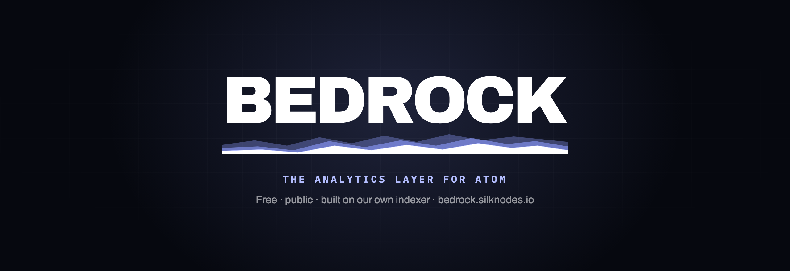

<p align="center">
  
</p>

<p align="center">
  <a href="https://bedrock.silknodes.io"></a>
  <a href="LICENSE"></a>
  
</p>

# Bedrock

**ATOM has explorers. It never had an analytics layer.**

Mintscan and every Cosmos explorer answer the same question well: *what happened.* Look up a transaction, check a balance, read a proposal. None of them answer the next one:

- Are large holders accumulating or distributing right now?
- What do stakers actually do with rewards after they claim them?
- How much of the Hub's governance weight sits on exchanges?
- Where does ATOM really go when it leaves?

Those are not lookups. They are analytics. Bedrock is that layer, and it is only about ATOM.

Free, public, no login, no token, nothing for sale. **[bedrock.silknodes.io](https://bedrock.silknodes.io)**

> No narrative. No predictions. Just receipts.

## What's in here

This repository is the **web application** — the Next.js frontend that renders the dashboard.

The indexer that feeds it (a Go service reading `cosmoshub-4` with two cursors: one pinned to the chain head, one walking forward from genesis) is **not part of this repository**. The site reads it over an HTTP API.

## What it does

| | |
| --- | --- |
| **41 pages** | every one about ATOM: supply, distribution, holders, genesis, whales, governance, market, cohorts, stakers, exchanges, validators |
| **22 snapshot cards** | every chart card exports itself as a post-ready 1200×675 PNG with the chart baked in |
| **Cohort analytics** | wallets bucketed by size, **netted per wallet** so router churn cancels instead of masquerading as selling |
| **Post-claim behaviour** | every reward claim followed for 48h: restaked, sent to an exchange, or held — split by stake tier |
| **Honest coverage** | charts label the window they actually cover, not the one they asked for; unattributed flow is shown, never guessed |

## Stack

- **Next.js 16** (App Router, React Server Components)
- **TypeScript**
- Charts are **hand-rolled inline SVG** — no chart library
- **Newsreader / Hanken Grotesk / Spline Sans Mono** via `next/font`
- No CSS framework; design tokens live in `app/globals.css`

## Getting started

```bash
pnpm install
cp .env.example .env.local     # point BEDROCK_INDEXER_URL at an indexer
pnpm dev                       # http://localhost:3000
```

The app expects an indexer on `BEDROCK_INDEXER_URL` (defaults to `http://127.0.0.1:8080`). Without one, pages that need live data render their "accruing" empty states rather than crashing.

```bash
pnpm build && pnpm start       # production build
```

## Layout

```
app/                 routes (App Router), one directory per page
  globals.css        design tokens + every shared style
components/
  console/           the card system (MetricCard, IntelCard, ChartCard)
  charts/            inline-SVG chart primitives
  share/             snapshot export (SocialCard, ShareCharts, ShareModal)
data/                static datasets (genesis holders, methodology, burn)
lib/                 indexer client, chain reads, price, SEO helper
public/Brand/        brand assets
```

## Conventions

- **Label the window you have, not the one you asked for.** The indexer returns only the weeks it has continuous data for; derive labels from `weeks.length`, never hardcode.
- **Static figures carry their vintage.** See `COVERAGE.as_of` in `data/methodology.ts` — if a number cannot be live, stamp when it was true.
- **Say when a number is a proxy.** Exchange deposits are sell *intent*, not confirmed sales, and every page that uses them says so.
- **No mock data.** If it is not real, it does not ship.

## Methodology

Every figure's rule is documented and versioned: **[/methodology](https://bedrock.silknodes.io/methodology)**
What "beta" means, and what the numbers are and are not: **[/disclaimer](https://bedrock.silknodes.io/disclaimer)**

## Contributing

Issues and PRs welcome — see [CONTRIBUTING.md](CONTRIBUTING.md). Found a wrong number? That is the most valuable report there is: open an issue, or use the public board at [/feedback](https://bedrock.silknodes.io/feedback).

## License

MIT — see [LICENSE](LICENSE).

---

<p align="center">
  Built by <a href="https://silknodes.io">Silk Nodes</a> · bare-metal validator infrastructure since 2021 · zero slashing<br>
  <sub>Informational only. Not financial advice.</sub>
</p>
